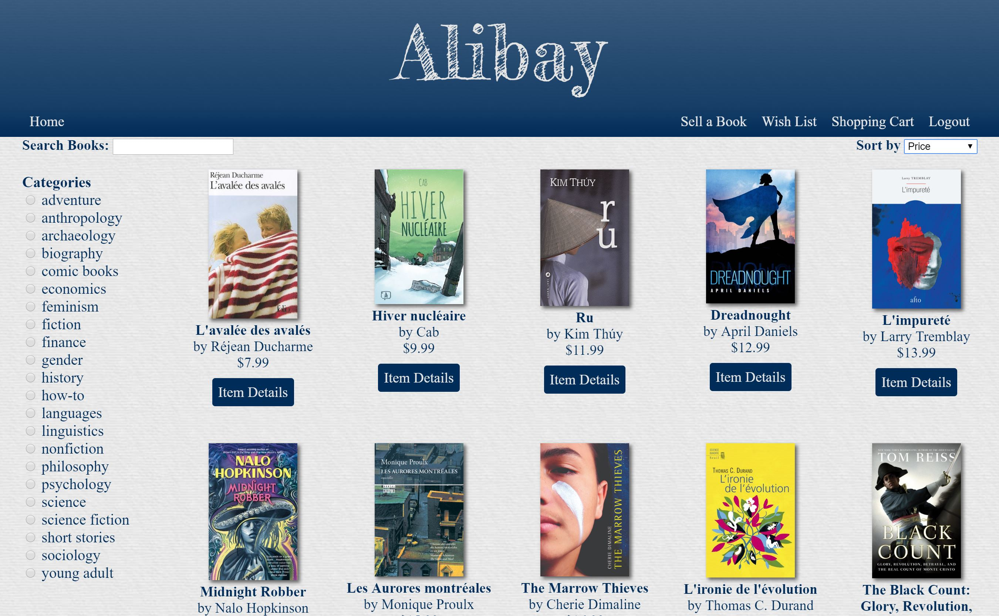
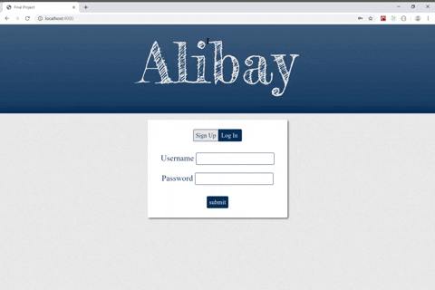
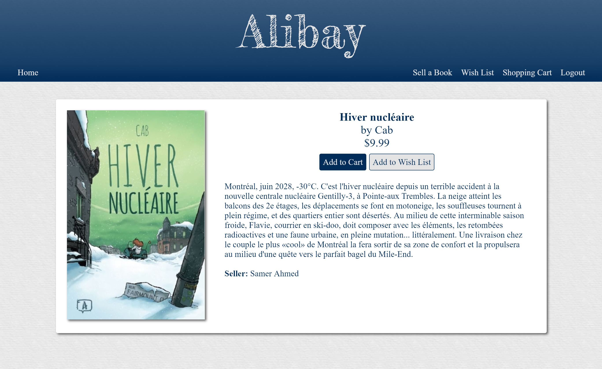
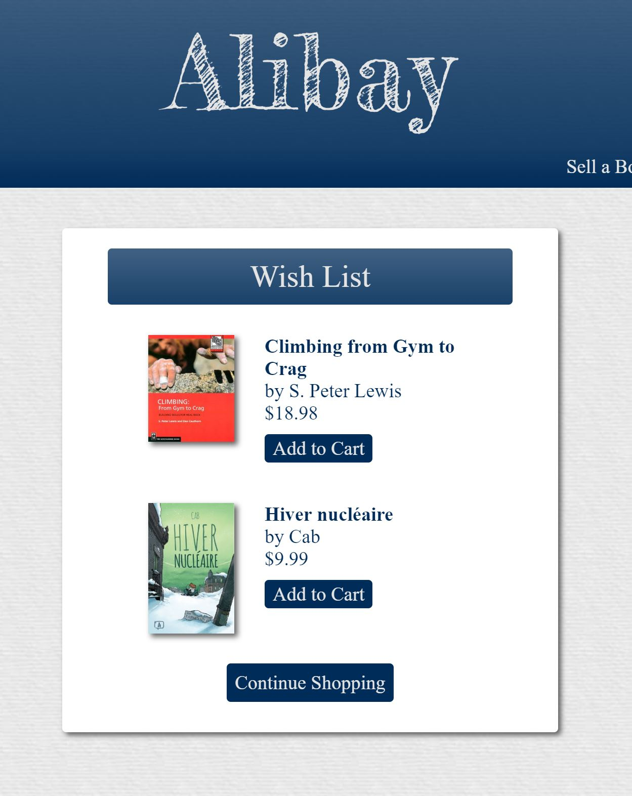
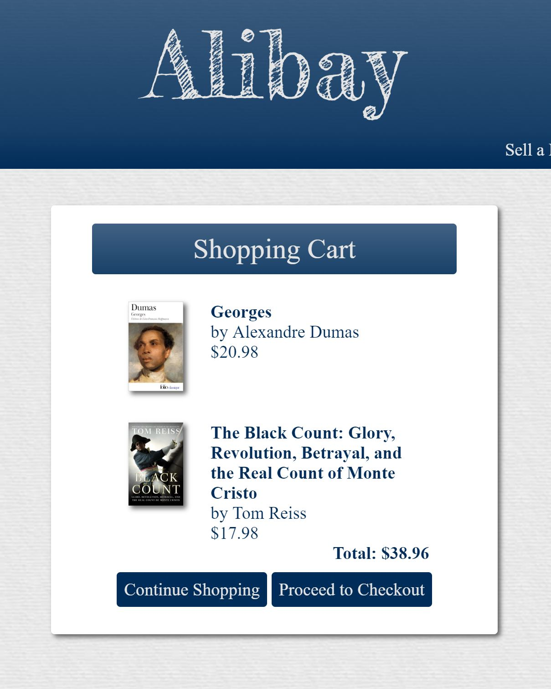
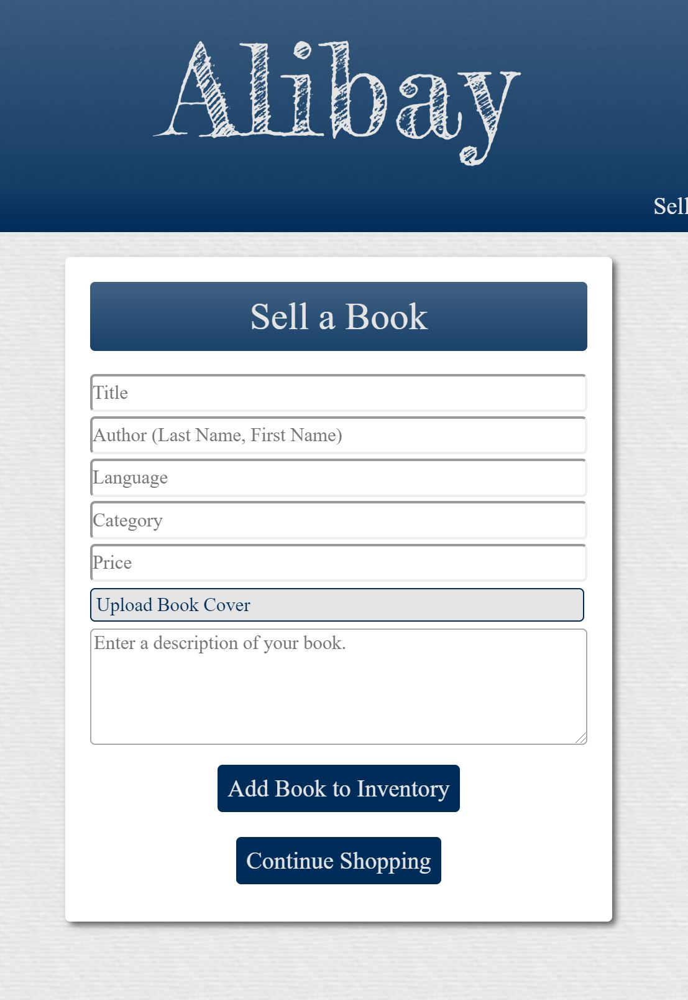

# Bookstore Marketplace

Built as a full-stack web application, Alibay is a marketplace that lets users find and sell books. It was my final project for the Concordia web development diploma program.

## Project features:

- User authentication
- Full catalogue search by title, filter by genre, and sort results by a variety of item properties
- Shopping-cart functionality, powered by Stripe
- Wish list functionality so users can remember items they’re interested in and transfer them to the cart at a future date
- Ability to sell books by adding them to the catalogue

## Technologies used:

The technologies used to build the Alibay Marketplace include HTML5, CSS3, JavaScript, React, Redux, Node.js, and Express.js

The demo video can be viewed at [heathermartin.ca/alibay.html](http://heathermartin.ca/alibay.html).

## Screenshots:

<figure>
 <figcaption>
 Login Screen
 </figcaption>
 
</figure>
<figure>
<figcaption>
 Item Detail
 </figcaption>
 
</figure>
<figure>
<figcaption>
 Wish List
 </figcaption>
 
</figure>
<figure>
<figcaption>
 Shopping Cart 
 </figcaption>
 
</figure>
<figure>
 <figcaption>
 Seller's Form
 </figcaption>
 
</figure>
